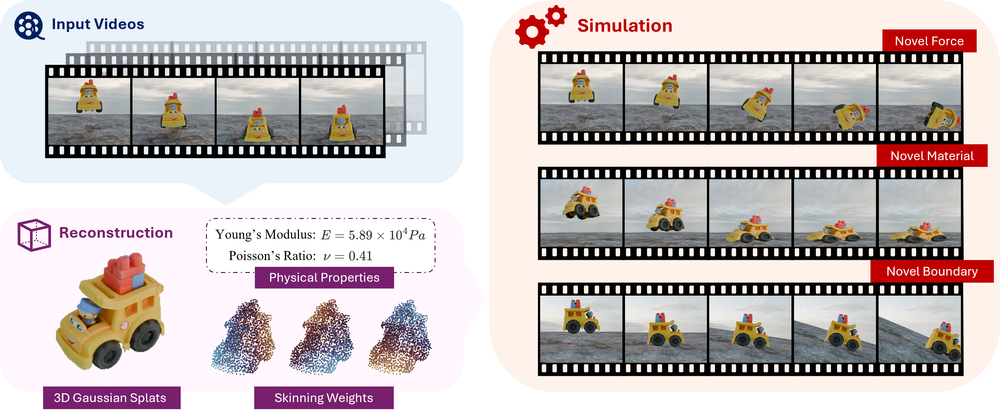
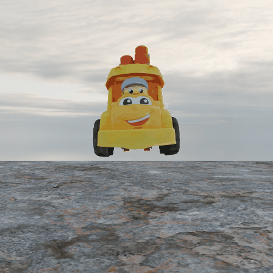

# Vid2Sim 

#### CVPR 2025

Official Implementation for ***Vid2Sim: Generalizable, Video-based Reconstruction of Appearance, Geometry and Physics for Mesh-free Simulation***

[Project Page](https://czzzzh.github.io/Vid2Sim) | [Paper Link](https://www.arxiv.org/pdf/2506.06440)




## 🔔 Updates
[07/07/2025]. We released our pipeline code, pre-trained model and the GSO testset


## 🚧 TODO List 
- [ ] Release the training dataset and related scripts

- [x] Release the pipeline code and pre-trained model

  

## 🌟 Quick Start
Following the steps in this section, you can run our whole pipeline to reconstruct the test videos simulated from [GSO](https://app.gazebosim.org/GoogleResearch/fuel/collections/Scanned%20Objects%20by%20Google%20Research) dataset.  

1. Install the dependencies (we have tested the scripts on **Ubuntu 22.04** + **Nvidia H100 / Nvidia RTX 4090**)

   ```bash
   conda create -n vid2sim python=3.10
   conda activate vid2sim2
   bash setup.sh
   ```

   Note that if you want to use different torch or cudatoolkit version, please also install the compatible version of [kaolin](https://github.com/NVIDIAGameWorks/kaolin)

2. Download the [test dataset](https://drive.google.com/file/d/1VOCkvOLDFmJW0Ma6tqwaXW6vSRxhxe49/view?usp=sharing) and [checkpoints](https://drive.google.com/file/d/1_djvSuoLUXjewOBY77W7bGCt2Nywhk3C/view?usp=sharing) (including pre-trained models and LBS template network), unzip and put them into `dataset` and `checkpoints`. The folder structure should be

      ```bash
      Vid2Sim
      |-- dataset
          └-- GSO
          	|-- backpack
          	|-- ...
          	└-- turtle
      |-- checkpoints
          |-- ckpt_lbs_template.pth
          |-- ckpt_lgm.safetensors
          └-- ckpt_phys_predictor.pth
      ```

3. Run the script to reconstruct the **toy bus** case. 

   ```bash
   python run_pipeline.py --data_name bus
   ```

   This script will run our **2-stage pipeline** to reconstruct the to appearance, geometry and physics from input videos. The script follows a single default config file `config/gso.yaml` that works for all the cases in this test set. You can modify the config as you need when you use your own data.

   The **frames** will be generated at `outputs/bus`(left video is **ground-truth** and right video is **reconstruction**)

    
   
   

## 🔥 Train the feed-forward predictor with Objaverse data

Our feed-forward predictor was trained on **50k** simulated animations using high-quality objects from the Objaverse dataset. 

Due to policy restrictions, we are not able to release **the originals objaverse object IDs** we used for our model. Nevertheless, [TRELLIS](https://github.com/microsoft/TRELLIS) provides filtered high-quality Objaverse object list which can be used as a good subtitution.

We will provide a **step-by-step** tutorial for creating the training dataset using [TRELLIS](https://github.com/microsoft/TRELLIS) data list & training the feed-forward predictor (including related scripts) in this section soon! We will also provide the rendered data for direct download later.


## 🍀 Acknowledgement

We acknowledge the following repositories for borrowing the codes:

**Simplicits:** https://github.com/NVIDIAGameWorks/kaolin/tree/master/examples/tutorial/physics

**LGM:** https://github.com/3DTopia/LGM

**3DGS** https://github.com/graphdeco-inria/gaussian-splatting


## 📜 Citation	

If you find this repository useful in your project, welcome to cite our work :)

```
@inproceedings{chen2025vid2sim,
  title={Vid2Sim: Generalizable, Video-based Reconstruction of Appearance, Geometry and Physics for Mesh-free Simulation},
  author={Chen, Chuhao and Dou, Zhiyang and Wang, Chen and Huang, Yiming and Chen, Anjun and Feng, Qiao and Gu, Jiatao and Liu, Lingjie},
  booktitle={Proceedings of the Computer Vision and Pattern Recognition Conference},
  pages={26545--26555},
  year={2025}
}
```

